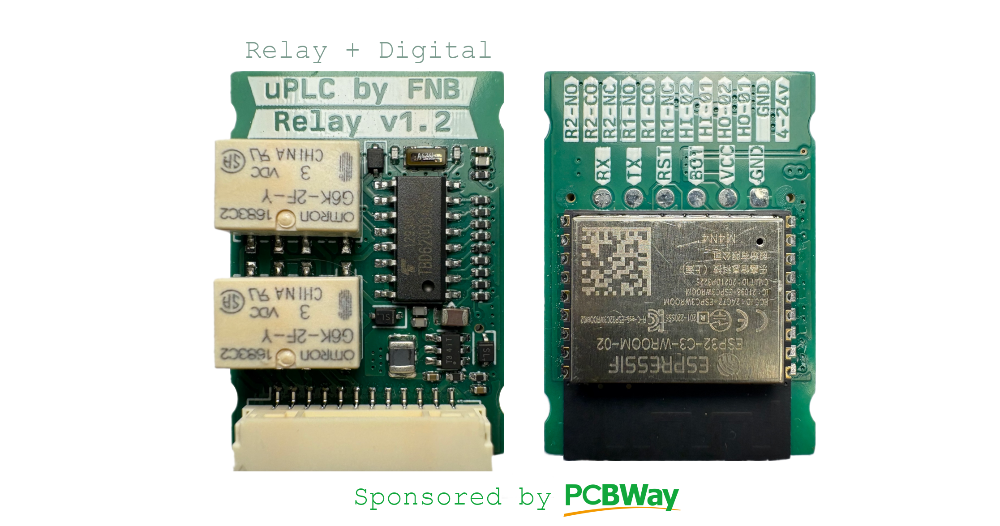
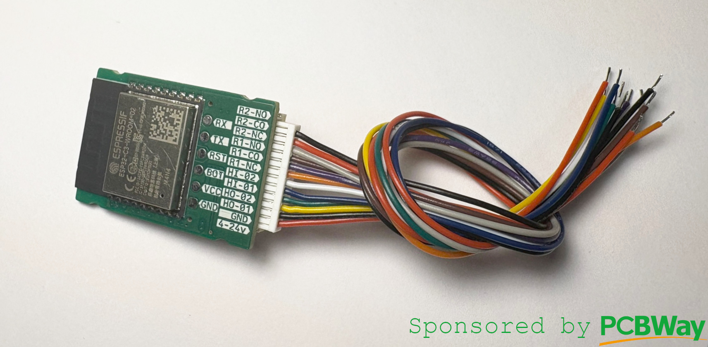
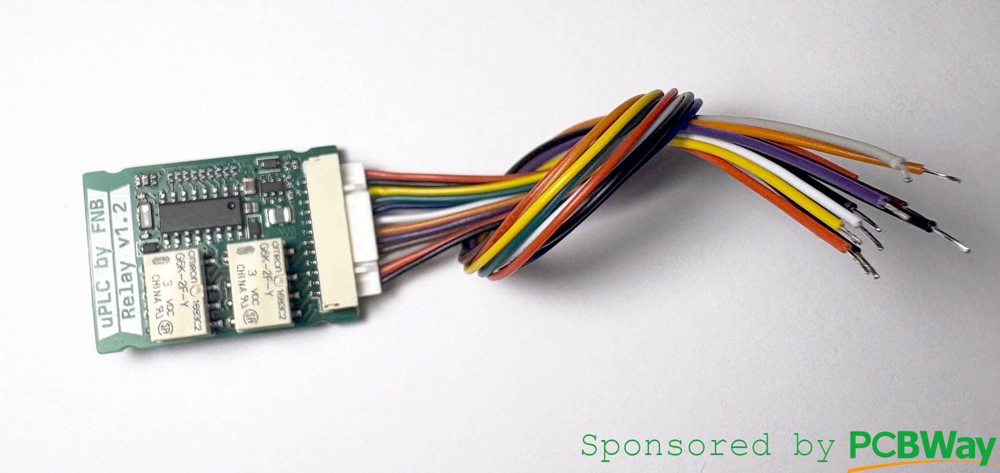
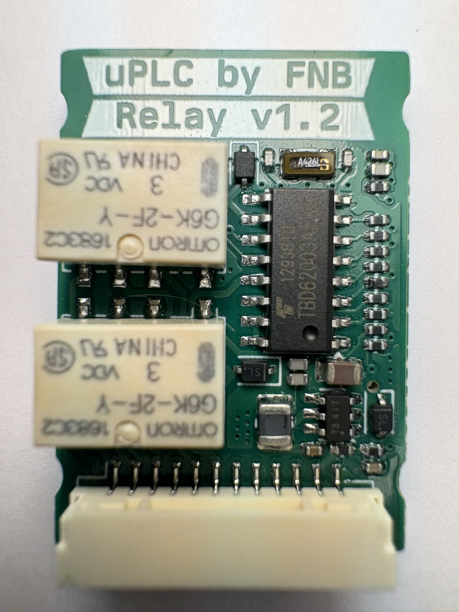
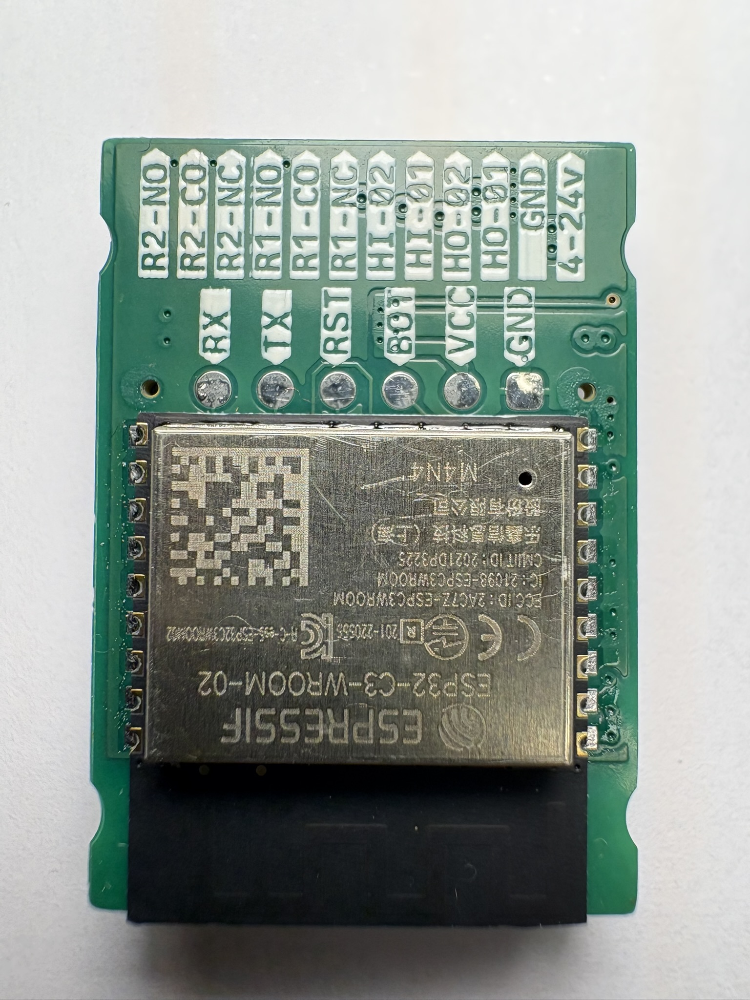

# μPLC-Relay
### Pcbway Sponsorship

Thanks so much to PCBWay who offered to assemble my first prototype batch of all three [uPLC modules](https://github.com/fredriknk/uPLC-stack). They deliver awesome quality as always, see the result for yourself below.

 I now have two prototypes of the uPLC-Relay so ESP-Home integrations will come soon.

ESP micro PLC the size of a post stamp. he uPLC-relay version  has two small signal relay module utilizing an [ESP-32-C3](./DOCUMENTATION/esp-12f_product_specification_en.pdf) wifi, bluetooth module for communication and MCU, it has a 0-24V buck regulator, has two 2.5-25V inputs, two 25v, 100/50ma high speed open drain output through a [TBD062003](./DOCUMENTATION/2304140030_TOSHIBA-TBD62003AFWG_C114084.pdf) DMOS transistor array ic. And two relay outputs are capable of driving around 25V 500ma. 

Thanks to [u/PricelessToolkit/ESPClicker](https://github.com/PricelessToolkit/ESPClicker) for inspiration.

[Schematic](./DOCUMENTATION/_schematic.pdf)

[Assembly IBOM](https://htmlpreview.github.io/?https://raw.githubusercontent.com/fredriknk/uplc/main/DOCUMENTATION/ibom.html)

## Specifications
| **Parameter**   | **Description**                                                     |
|-----------------|---------------------------------------------------------------------|
| _Input voltage_ | 3.8-24v                               |
| _Current_       | TBD Wifi: ##mA, Radio Off: ##mA, Deep sleep ##uA |  
| _Communication_ | 2.4ghz WIFI, Uart TTL                            |
| _Baudrate_      | 115200                                                              |
| _PCB size_      | 22x31.1mm                                                             |
| _PCB info_      | 1.6mm FR4, HASL lead free, 4 layer               |
| _Case size_     | XxXxXmm TBD                                                         |

## Connector

| **Label**   | **GPIO**|**Description**       |
|------------|-----|-------------------------|
|_R2NO_ | GPIO5 | Relay 1 Normally Open |
|_R2CO_ | GPIO5  | Relay 1 COM |
|_R2NC_ | GPIO5 | Relay 1 Normally Closed |
|_R1NO_ | GPIO6 | Relay 1 Normally Open |
|_R1CO_ | GPIO6  | Relay 1 COM |
|_R1NC_ | GPIO6 | Relay 1 Normally Closed |
|_HI2_ | GPIO19 | 2.5-25v input |
|_HI1_ | GPIO18 | 2.5-25v input |
|_HO2_ | GPIO3 | 25v 50ma open drain output |
|_HO1_ | GPIO7 | 25v 100ma open drain output |
|_4-24V_ | 3V3 |4-24v |
|_GND_ | GND |  Ground  |

## PCB Pictures

## Homeassistant Implementation
TODO

## FIRST PRODUCTION PROTOTYPE
TODO
