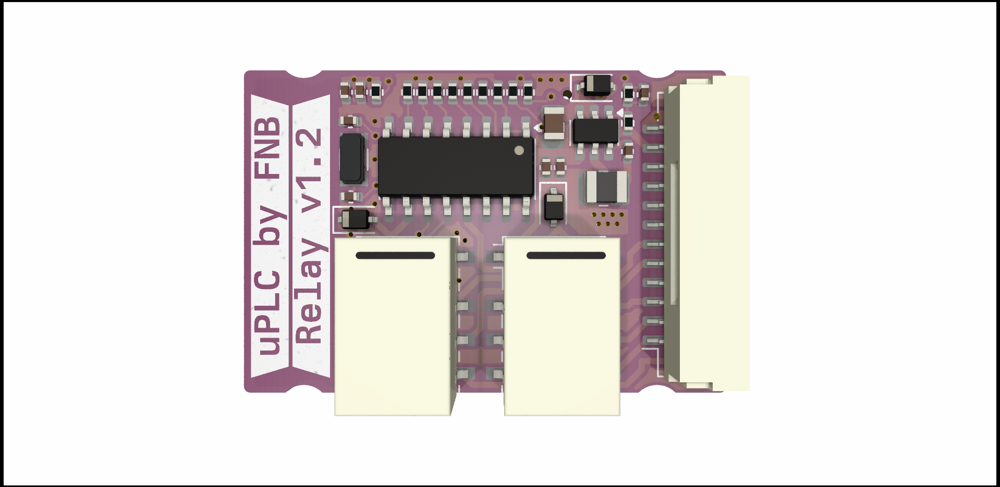
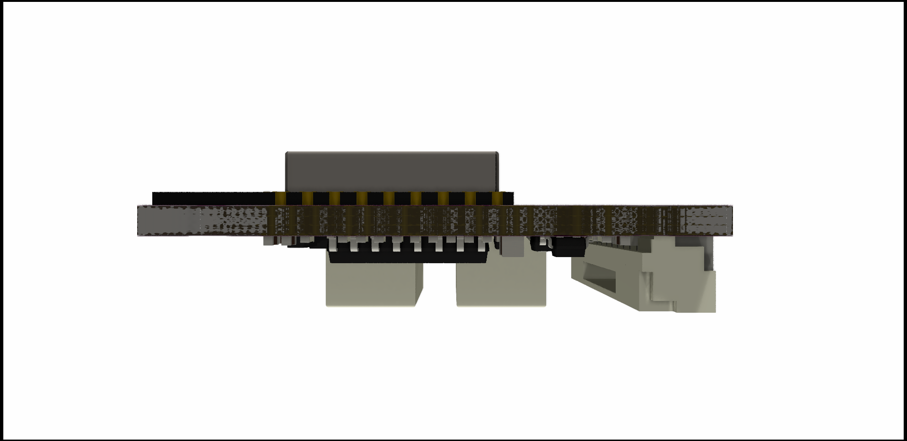
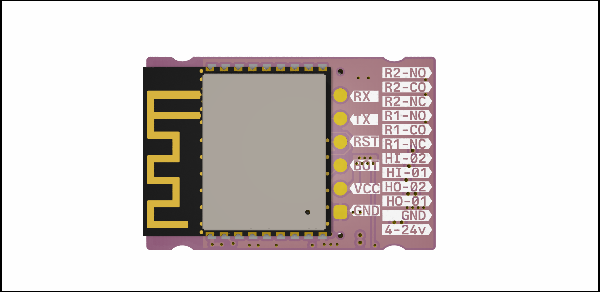

# ESPRELAY -_WORK IN PROGRESS-UNTESTED_-

ESP8266 small signal relay module utilizing an [ESP-12-F](./DOCUMENTATION/esp-12f_product_specification_en.pdf) wifi module for communication and MCU,it has a [SHTC3 ](./DOCUMENTATION/Datasheet_SHTC3.pdf) temp sensor, [light sensing diode](./DOCUMENTATION/1806131537_Everlight-Elec-ALS-PT19-315C-L177-TR8_C146233.pdf), and has two 2.5-25V inputs, and a single 25v, 100ma high speed open drain output through a [TBD062003](./DOCUMENTATION/2304140030_TOSHIBA-TBD62003AFWG_C114084.pdf) DMOS transistor array ic. The three relay outputs are capable of driving around 25V 500ma. 

Thanks to [u/PricelessToolkit/ESPClicker](https://github.com/PricelessToolkit/ESPClicker) for inspiration. If you need a ready to use product you should so head over to his [store](https://www.pricelesstoolkit.com/en/projects/32-espclicker-0741049314405.html) and buy his version.

[Schematic](./DOCUMENTATION/_schematic.pdf)

[Assembly IBOM](https://htmlpreview.github.io/?https://raw.githubusercontent.com/fredriknk/esprelay/main/DOCUMENTATION/ibom.html)

## Specifications
| **Parameter**   | **Description**                                                     |
|-----------------|---------------------------------------------------------------------|
| _Input voltage_ | 5-15v                               |
| _Current_       | TBD Wifi: ##mA, Radio Off: ##mA, Deep sleep ##uA |  
| _Communication_ | 2.4ghz WIFI, Uart TTL                            |
| _Baudrate_      | 115200                                                              |
| _PCB size_      | 20x65mm                                                             |
| _PCB info_      | 1.6mm FR4, HASL lead free, 4 layer (But works with 2)               |
| _Case size_     | XxXxXmm TBD                                                         |

## Connector
| **Pin**   | **GPIO**|**Description**       |
|------------|-----|-------------------------|
|_vcc_ | -|5-15v |
|_GND_ | -|  Ground  |
|_HI1_ | GPIO4 | 2.5-25v input |
|_HI1_ | GPIO5 | 2.5-25v input |
|_HO1_ | GPIO13 | 25v 100ma open drain output |
|_R1A_ | GPIO12  | Relay 1 COM |
|_R1NC_ | GPIO12 | Relay 1 Normally Closed |
|_R1NO_ | GPIO12 | Relay 1 Normally Open |
|_R2A_ | GPIO12  | Relay 1 COM |
|_R2NO_ | GPIO12 | Relay 1 Normally Open |
|_R3A_ | GPIO12  | Relay 1 COM |
|_R3NO_ | GPIO12 | Relay 1 Normally Open |

## PCB Pictures

## Homeassistant Implementation
TODO

## FIRST PRODUCTION PROTOTYPE
TODO